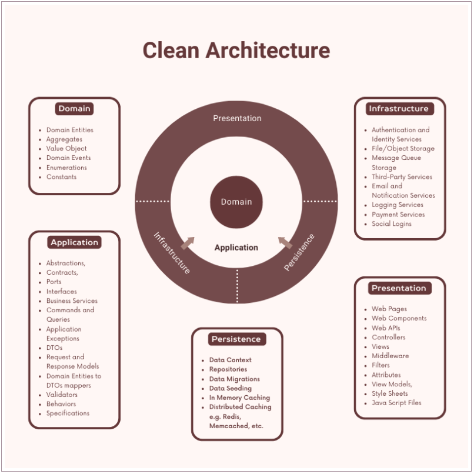

# Azure Function

## Overview

Azure function is used .NET Core 8.0 for Paradigm project

## Table of Contents

- [Getting Started](#getting-started)
  - [Prerequisites](#prerequisites)
  - [Installation](#installation)
- [Architecture](#architecture)
- [Configuration](#configuration)
- [Testing](#testing)
- [Contributing](#contributing)
- [License](#license)

## Getting Started

### Prerequisites

Prerequisites that we need to have installed before using Petcare API.

- [.NET Core 8.0 SDK](https://dotnet.microsoft.com/en-us/download/dotnet/8.0)
- [Azure CLI](https://learn.microsoft.com/en-us/cli/azure/install-azure-cli)

### Installation

1. Clone the repository:

```bash
git clone https://github.com/quyenhua/azure-function.git
cd azure-function
```

2. Update local setting in `appsettings.json`

   For example,

   ```bash
   {
    "IsEncrypted": false,
    "Values": {
        "AzureWebJobsStorage": "UseDevelopmentStorage=true",
        "FUNCTIONS_WORKER_RUNTIME": "dotnet-isolated"
    }
   }
   ```

3. Run Azure Function:

```bash
dotnet restore
dotnet build
dotnet run
```

## Architecture



[Reference clean architecture document](https://www.ezzylearning.net/tutorial/building-asp-net-core-apps-with-clean-architecture)

## Configuration

Adjust the configuration settings in appsettings.json as needed.

## Testing

Run tests to ensure the API functions correctly:

```bash
dotnet test
```

## Contributing

We welcome contributions! Follow our Contribution Guidelines to get started.

## License

This project is licensed under the MIT License.
